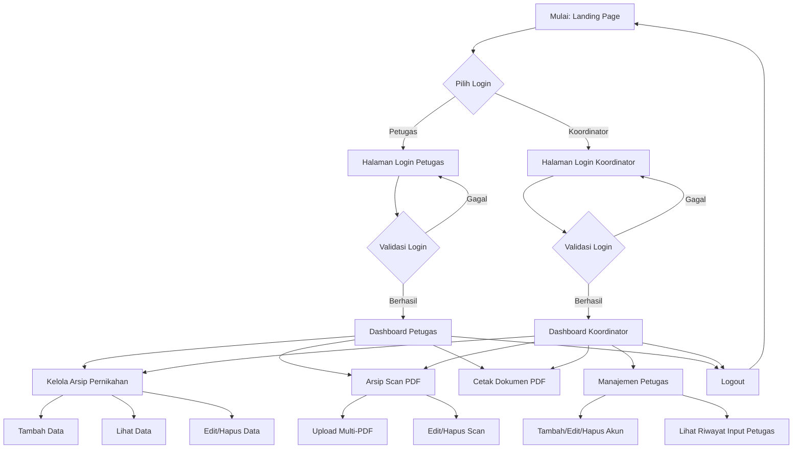

# Penjelasan Flowchart Sistem Arsip Pernikahan

Flowchart ini menggambarkan alur kerja sistem dari saat pengguna masuk hingga mengelola data arsip atau petugas.

## Visualisasi Alur (Mermaid)

## Penjelasan Komponen Flowchart

1. **Landing Page**: Titik masuk utama di mana pengguna memilih peran mereka (Petugas atau Koordinator).
2. **Pilih Login**: Percabangan untuk menentukan form login mana yang akan digunakan.
3. **Validasi Login**: Sistem mengecek username dan password menggunakan `password_verify`. Jika gagal, kembali ke form login. Jika berhasil, diarahkan ke Dashboard.
4. **Dashboard**: Pusat kendali sistem.
   - **Petugas**: Memiliki akses ke fitur operasional arsip (Input data, Upload PDF, Cetak).
   - **Koordinator**: Memiliki akses ke fitur operasional + fitur administratif (Mengelola akun petugas lain dan memantau kinerja mereka).
5. **Kelola Arsip Pernikahan**: Fitur utama untuk menginput data akta nikah beserta pas foto suami dan istri.
6. **Arsip Scan PDF**: Modul khusus untuk mengarsipkan dokumen yang sudah dalam bentuk PDF.
7. **Cetak Dokumen PDF**: Fitur untuk menghasilkan dokumen detail arsip yang siap cetak menggunakan library `dompdf`.
8. **Manajemen Petugas**: Khusus koordinator, digunakan untuk menambah petugas baru atau mengedit akun yang ada.
9. **Logout**: Menghapus session pengguna dan mengembalikan mereka ke halaman Landing.

---

**Catatan**: Anda dapat mengimpor file `flowchart_system.drawio` yang saya buat ke situs [diagrams.net (draw.io)](https://app.diagrams.net) untuk mendapatkan tampilan visual yang lebih interaktif dan profesional.
